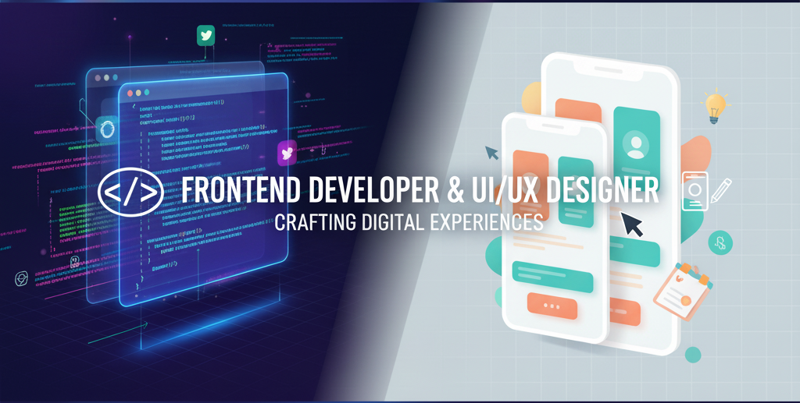

<!-- Banner -->

  

<h1 align="center">Hi 👋, I'm Sanjay D</h1>
<h3 align="center">A passionate Frontend Developer and UI/UX Designer from India</h3>

---

### 🚀 About Me  
- 🔭 I’m currently working on **Frontend Development & UI/UX Projects**  
- 🌱 I’m currently learning **Node.js & JavaScript (ES6)**  
- 🎨 Skilled in **Figma** for UI/UX Design  
- ⚡ I enjoy creating **responsive, user-friendly web apps**  

---

### 🛠️ Skills  

#### 💻 Programming & Web Development  

 
  
  
  
  

#### 🎨 UI/UX Design  

   

---

### 📫 Connect with Me  

  
  

---

⭐️ From [Sanjay D](https://github.com/YOUR-GITHUB-USERNAME)
